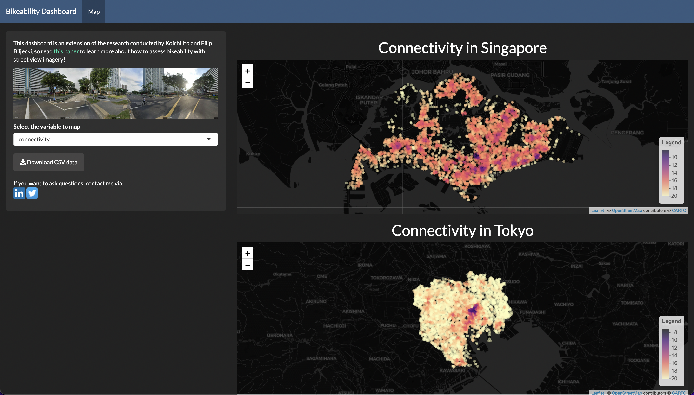

<!-- README.md is generated from README.Rmd. Please edit that file -->

# bikeabilitymap

<!-- badges: start -->

<!-- badges: end -->

This repo is used to produce a dashboard of bikeability
(bike-friendliness) in Singapore and Tokyo.

Please read [my published
paper](https://www.researchgate.net/publication/354710278_Assessing_bikeability_with_street_view_imagery_and_computer_vision)
to learn more about it!

You can see the dashboard
[here](https://koichi-ito.shinyapps.io/bikeabilitymap/) and download the
data as well! 
